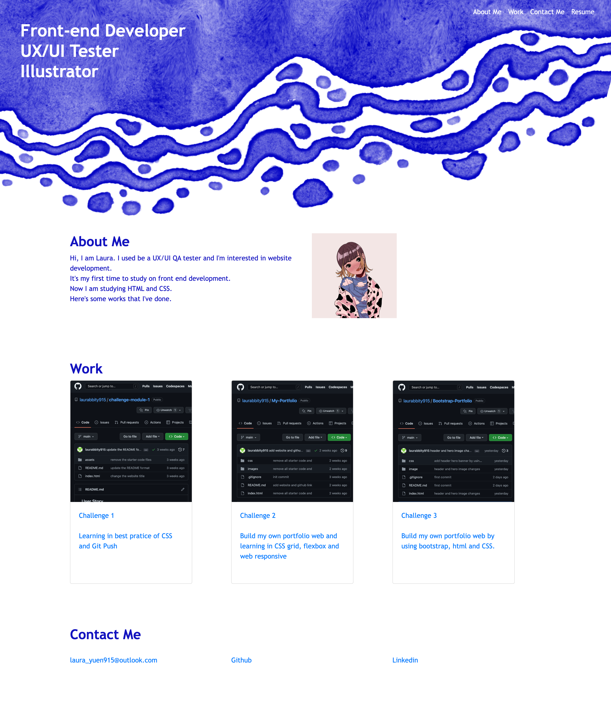

# Unit 3 Challenge: UX and Advanced CSS: Bootstrap Portfolio

I would like to create my own portfolio web page with my Github link and my contacts by using Bootstrape.

I change the UI of my portfolio and I try to use Bootstrape on the navigation, and I try to use the grid and the card of Boostrape.

When you click the navigations, should scroll down to the correct section.

And I put some projects I've done and when you click the picture at "Work" section, it will bring you to the Github of that project.

I put my contact at the bottom, feel free to contact:)

## Website
https://laurabbity915.github.io/Bootstrap-Portfolio/

## Github
https://github.com/laurabbity915/Bootstrap-Portfolio 

